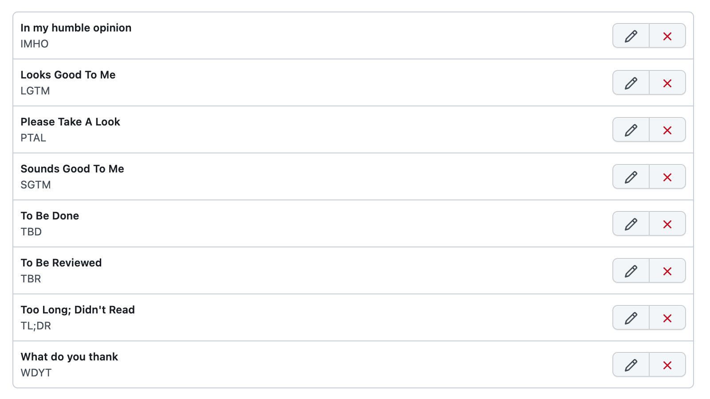

# Github Saved Replies

This repo will help to build github saved replies like the following:

## Usage

- Open [Saved replies](https://github.com/settings/replies)
- Open your browser's console (`F12`)
- Copy all code from [index.js](index.js) and running in console

After setting up, you can use `Ctrl+.` to trigger saved reply in issues or PR!

## Safety

Our code in `index.js` is simple and safe, none of your data will be leaked.

## Acknowledgment

Highly inspired by [@junnplus](https://twitter.com/junnplus)'s [tweet](https://twitter.com/junnplus/status/1523294594871439360).
